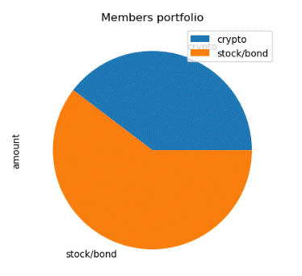

# Financial Planner for Emergencies and Financial Planner for Retirement

Module 5 Challenge Work

* The Financial Planner for Emergencies 
The members will be able to use this tool to visualize their current savings. 
The members can then determine if they have enough reserves for an emergency fund.

* The Financial Planner for Retirement
This tool will forecast the performance of their retirement portfolio in 30 years. 
To do this, the tool will make an Alpaca API call via the Alpaca SDK to get historical price data for use in Monte Carlo simulations.

The tool produces a pie chart that visualizes the member's holdings in Crypto and Stocks/Bonds

The Financial Planner for Retirement tool utilized Monte Carlo Technique to project the investment balance
at the end of 30 year and also at the end of 10 year period

---
## Technologies

This challenge submission uses python 3.7.13 with the following packages:
* [os] (https://docs.python.org/3/library/os.html)
* [requests] (https://pypi.org/project/requests/)
* [json] (https://docs.python.org/3/library/json.html)
* [dotenv] (https://pypi.org/project/python-dotenv/)
* [alpaca_trade_api] (https://alpaca.markets/docs/)
* [MCForecastTools.py] 

## Pre-requisites
You must have an .env file with the following keys in the env file to successfully run the jupyter notebook

* ALPACA_API_KEY
* ALPACA_SECRET_KEY

## Contributors

[Sreedhar](j_sreedhar@yahoo.com)
---

## License

MIT
